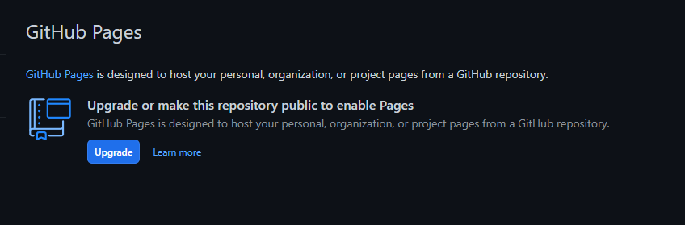

# Markdown Template
This project is just an example of how to use [Obsidian.Md](https://obsidian.md/) and [Material for MkDocs](https://squidfunk.github.io/mkdocs-material/) to generate documentation to host on [Github Pages](https://pages.github.com/).

> [!WARNING] Github Pages Limitation
> Github free account only allows public repos to be hosted on Github Pages

You can view the generated site at [https://expt626.github.io/zombie-brain/](https://expt626.github.io/zombie-brain/)
