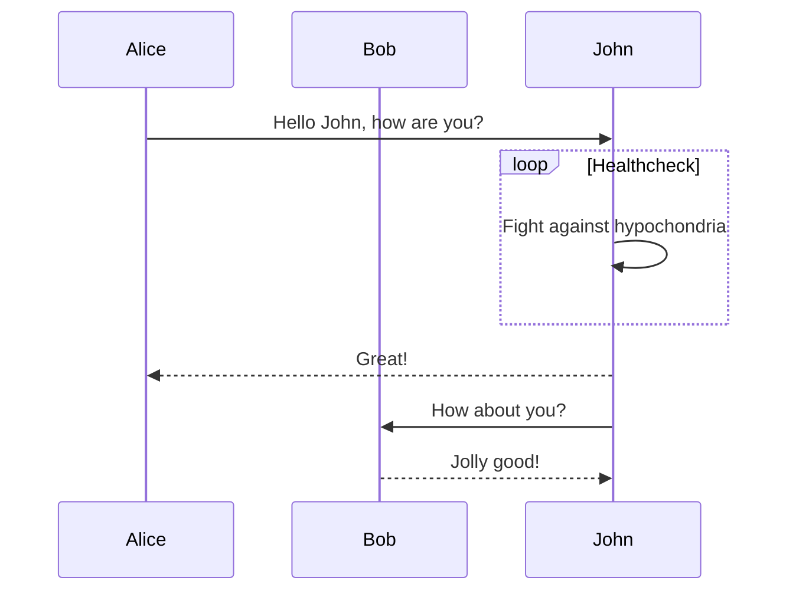

# Examples
What was tested so far

## Tables 
|name | race |
|---|---|
|cat | zombie |

## Callouts
> [!info] 

## Code Snippets

```c# 
// Hello World! program
namespace HelloWorld
{
    class Hello {         
        static void Main(string[] args)
        {
            System.Console.WriteLine("Hello World!");
        }
    }
}
```

## MermaidJS
[https://mermaid-js.github.io/mermaid/#/](https://mermaid-js.github.io/mermaid/#/)



# image links
this is in index folder 

![[test-img.png]]